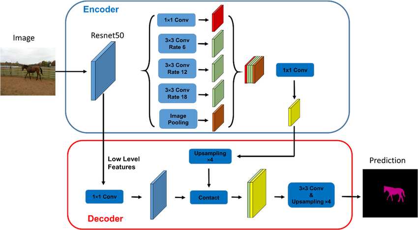
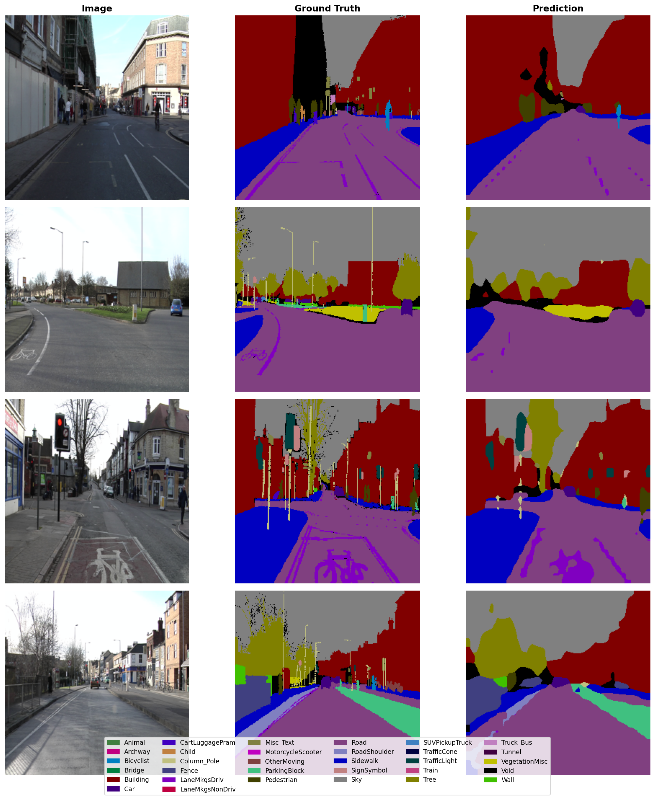
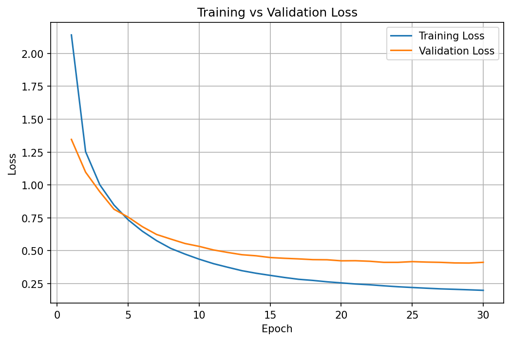
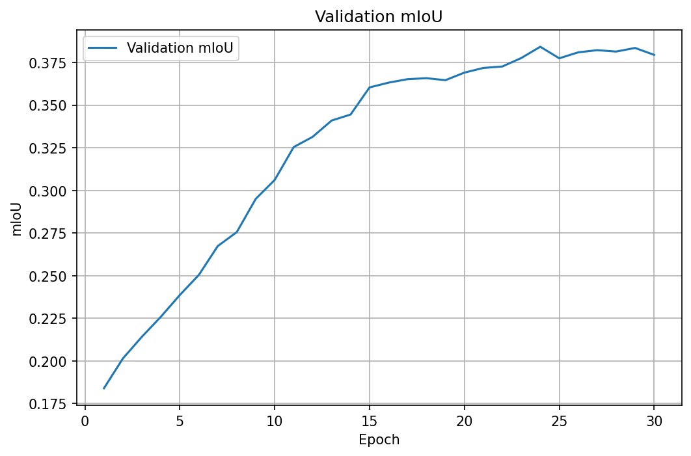
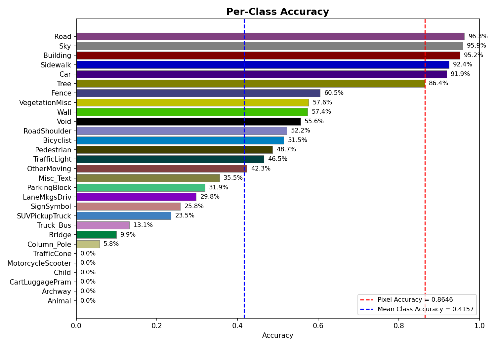
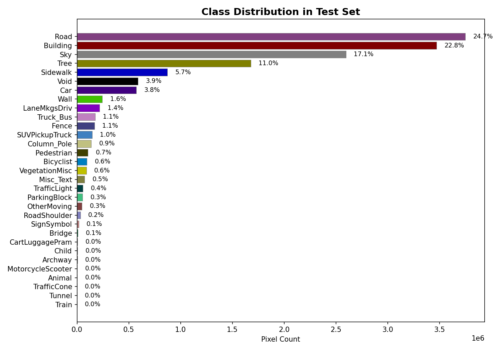

# Semantic Segmentation of CamVid Dataset using DeepLabv3

Pixel-wise semantic segmentation on urban driving scenes using **DeepLabv3**, implemented as a single end-to-end Jupyter Notebook.

---

## Overview

This project applies DeepLabv3 (ResNet backbone, pretrained on ImageNet) to the CamVid dataset. The notebook covers the full pipeline — data loading, training, evaluation, and visualization.

**Highlights:**
- Ground truth vs. predicted mask visualization
- Training & validation loss curves
- mIoU tracking across epochs
- Per-class accuracy breakdown
- Class pixel distribution analysis

---

## Dataset

The **Cambridge-driving Labeled Video Database (CamVid)** provides pixel-level ground truth labels for urban driving scenes, widely used in real-time semantic segmentation research.

| | |
|---|---|
| Total Images | 701 |
| Train / Val / Test | 367 / 101 / 233 |
| Original Classes | 32 |
| Classes Used | 11 (Sky, Building, Pole, Road, Pavement, Tree, SignSymbol, Fence, Car, Pedestrian, Bicyclist) |
| Resolution | 960 × 720 |
| Source | Extracted from 5 driving video sequences |

> Download from [Kaggle](https://www.kaggle.com/datasets/carlolepelaars/camvid) or the [official CamVid page](http://mi.eng.cam.ac.uk/research/projects/VideoRec/CamVid/).

---

## Model — DeepLabv3

DeepLabv3 (Chen et al., 2017) is a semantic segmentation model built on a **ResNet backbone** with **dilated (atrous) convolutions** to maintain spatial resolution without losing receptive field. Its core component is the **Atrous Spatial Pyramid Pooling (ASPP)** module, which applies parallel dilated convolutions at multiple rates to capture multi-scale context. The final feature map is upsampled back to the original input size to produce per-pixel class predictions.



---

## Project Structure

```
semantic-segmentation-camvid/
├── main.ipynb        # Full pipeline notebook
└── results/          # Output plots and visualizations
```

---

## Setup

```bash
git clone https://github.com/sauvik-d/semantic-segmentation-camvid.git
cd semantic-segmentation-camvid
pip install torch torchvision numpy opencv-python matplotlib scikit-learn Pillow tqdm
jupyter notebook main.ipynb
```

> GPU recommended. Works on Google Colab out of the box.

---

## Results

### Ground Truth vs. Predicted Masks


### Training & Validation Loss


### mIoU over Epochs


### Per-Class Accuracy


### Class Distribution



---

## References

- [DeepLabv3 — Chen et al., 2017](https://arxiv.org/abs/1706.05587)
- [CamVid Dataset — Brostow et al., 2008](http://mi.eng.cam.ac.uk/research/projects/VideoRec/CamVid/)
- [Image Segmentation: U-Net For Self Driving Cars](https://www.kaggle.com/code/vanvalkenberg/image-segmentation-u-net-for-self-driving-cars)
- [CamVid-Segmentation-Pytorch](https://github.com/UsamaI000/CamVid-Segmentation-Pytorch)
- [torchvision DeepLabv3](https://pytorch.org/vision/stable/models/deeplabv3.html)
